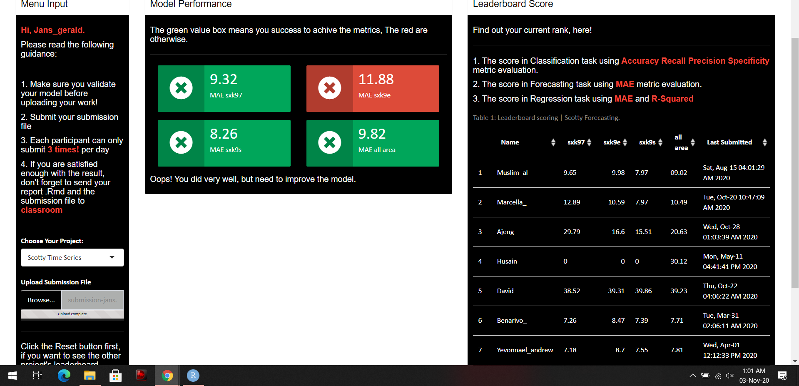

# Introduction {.tabset}
## Scotty's brief description
Scotty is a ride-sharing business operating in several big cities in Turkey. The company provides motorcycles ride-sharing service for Turkey’s citizen, and really value the efficiency in traveling through the traffic–the apps even give some reference to Star Trek “beam me up” in their order buttons.

Scotty provided us with a real-time transaction dataset. With this dataset, we are going to help them in solving some forecasting and classification problems in order to improve their business processes.

## Case
Scotty: “Bring me the crystal ball!”
It’s almost the end of 2017 and we need to prepare a forecast model to helps Scotty ready for the end year’s demands. Unfortunately, Scotty is not old enough to have last year’s data for December, so we can not look back at past demands to prepare forecast for December’s demands. Fortunately, you already know that time series analysis is more than enough to help us to forecast! But, as an investment for the business’ future, we need to develop an automated forecasting framework so we don’t have to meddle with forecast model selection anymore in the future!
**Build an automated forecasting model for hourly demands that would be evaluated on the next 7 days (Sunday, December 3rd 2017 to Monday, December 9th 2017)!**

## Library
Library use in this project.

```{r}
library(forecast)
library(lubridate)
library(magrittr)
library(tidymodels)
library(tidyverse)
library(MLmetrics)
library(plotly)
library(yardstick)
```

# Import Data

```{r cars}
scotty <- read_csv("data/data-train.csv")
head(scotty)
```

```{r}
glimpse(scotty)
```

```{r}
scotty %>% 
  is.na() %>% 
  colSums()
```

# Data Preprocess{.tabset}
## Data Aggregation
We need to round the time component into an hour unit for easy data analysis, as it makes no sense to predict with a minute pattern or a second pattern in this case.

```{r}
data_clean <- scotty %>% 
   mutate(datetime = floor_date(x = start_time, 
                                unit = "hour"))
```

We group data and summarise
```{r}
data_clean <- data_clean %>% 
   group_by(src_sub_area, datetime) %>%
   summarise(demand = n())
```
## Time Series Padding
We need to do time series padding because in time series modelling, the data must be sorted based on time, time must not be missed, and there should be no missing value.

```{r}
range(data_clean$datetime)
```


```{r}
library(padr)
data_clean <- data_clean %>% 
   group_by(src_sub_area) %>% 
   pad(start_val = ymd_hms("2017-10-01 00:00:00"),
       end_val = ymd_hms("2017-12-02 23:00:00")) %>% 
   ungroup()
```

```{r}
data_clean <- data_clean %>% 
   mutate(demand = replace_na(data = demand,
                              replace = 0))

data_clean
```

# Exploratory Data Analysis{.tabset}

Visualization of demand data per sub area can be seen in the plot below.
```{r}
data_clean %>%
   ggplot(aes(x = datetime, y=demand)) +
   geom_line(aes(col = src_sub_area)) +
   facet_wrap(facets = "src_sub_area",ncol = 1) +
   theme(legend.position = "none")
```

## Daily Decomposition
```{r}
data_clean %>% 
  filter(src_sub_area == "sxk97") %>% 
  .$demand %>% 
  ts(frequency = 24) %>% 
  decompose() %>% 
  autoplot() +
  labs(title = "Daily Decomposition") + 
  theme(plot.title = element_text(hjust = 0.5))
```

## Weekly Decomposition
```{r}
data_clean %>% 
  filter(src_sub_area == "sxk97") %>% 
  .$demand %>% 
  ts(frequency = 24*7) %>% 
  decompose() %>% 
  autoplot() +
  labs(title = "Weekly Decomposition") + 
  theme(plot.title = element_text(hjust = 0.5))
```

## Multi Seasonal Decomposition
```{r}
data_clean %>% 
  filter(src_sub_area == "sxk97") %>% 
  .$demand %>% 
  msts(seasonal.periods = c(24, 24*7)) %>% 
  mstl() %>% 
  autoplot() +
  labs(title = "Multi Seasonal Decomposition") + 
  theme(plot.title = element_text(hjust = 0.5))
```

# Cross Validation
Cross Validation by dividing data into Train data (to train models) and Test data (to evaluate models). Test data is obtained from last week's observations and the rest is fed into train data. We use rolling origin method.


```{r}
test_size <- 24 * 7


test_end <- max(data_clean$datetime)
test_start <- test_end - hours(test_size) + hours(1)

train_end <- test_start - hours(1)
train_start <- min(data_clean$datetime)

intrain <- interval(train_start, train_end)
intest <- interval(test_start, test_end)
```

```{r}
data_clean %<>%
  mutate(sample = case_when(
    datetime %within% intrain ~ "train",
    datetime %within% intest ~ "test"
  )) %>% 
  drop_na()

head(data_clean)
```

We need to scale the data by do spread, recipe and bake the data 

```{r}
data_clean %<>%
  spread(src_sub_area, demand)

rec <- recipe(~ ., filter(data_clean)) %>%
  step_sqrt(all_numeric()) %>%
  step_center(all_numeric()) %>%
  step_scale(all_numeric()) %>%
  prep()

data_clean <- bake(rec, data_clean)
```

Convert the data into long format again
```{r}
data_clean %<>%
  gather(src_sub_area, demand, -datetime,-sample)

head(data_clean)
```


After that we need to returns the data to a value with the actual scale with revert
```{r}
rec_revert <- function(vector, rec, varname) {
  rec_center <- rec$steps[[2]]$means[varname]
  rec_scale <- rec$steps[[3]]$sds[varname]
  results <- (vector * rec_scale + rec_center) ^ 2
  results <- round(results)
  results
}
```

We need to nest training data and Test data to facilitate the model selection process, before nesting we need to group the data by the source area.
```{r}
data_clean %<>%
  group_by(src_sub_area, sample) %>%
  nest(.key = "data") %>%
  spread(sample, data)

data_clean
```
# Preparing the Data Model List
Create object time series and multiple seasonality time series. I'm going to try both types of time series objects on the modeling and see which object gives the smallest error when the model does the prediction.

```{r}
data_funs <- list(
  ts = function(x) ts(x$demand, frequency = 24),
  msts = function(x) msts(x$demand, seasonal.periods = c(24, 24 * 7))
)
```

```{r}
data_funs %<>%
  rep(length(unique(data_clean$src_sub_area))) %>%
  enframe("data_fun_name", "data_fun") %>%
  mutate(src_sub_area =
    sort(rep(unique(data_clean$src_sub_area), length(unique(.$data_fun_name))))
  )
```

```{r}
data_clean %<>% left_join(data_funs)
```
```{r}
head(data_clean)
```

# Preparing the Time Series Model List
Next, create a list of model algorithms that you want to apply to the dataset. 
1. Exponential Smoothing State Space Model (ets)
2. Seasonal and Trend decomposition using Loess (stlm)
3. Trigonometric seasonality, Box-Cox transformation, ARMA errors, Trend and Seasonal components (tbats)
4. Autoregressive integrated moving average (arima)
5. Holt Winter

I'll try all those models, then see which model gives the smallest error when the model predicts. Especially for ets and arima models, it is not applied to multiple seasonal time series objects because they are not compatible with those objects.

```{r}
models <- list(
  ets = function(x) ets(x),
  stlm = function(x) stlm(x),
  tbats = function(x) tbats(x),
  auto.arima = function(x) auto.arima(x),
  holt.winter = function(x) HoltWinters(x,seasonal = "additive")
)


models %<>%
  rep(length(unique(data_clean$src_sub_area))) %>%
  enframe("model_name", "model") %>%
  mutate(src_sub_area =
    sort(rep(unique(data_clean$src_sub_area), length(unique(.$model_name))))
  )
models
```

```{r}
data_clean %<>% 
  left_join(models) %>% 
  filter(!(model_name == "ets" & data_fun_name == "msts"),
         !(model_name == "auto.arima" & data_fun_name == "msts"))
```

```{r}
head(data_clean)
```

Applies the time series object creation function and modeling algorithm to the dataset.

```{r}
data_clean %<>%
  mutate(
    params = map(train, ~ list(x = .x)),
    data = invoke_map(data_fun, params),
    params = map(data, ~ list(x = .x)),
    fitted = invoke_map(model, params)
  ) %>%
  select(-data, -params)
```

```{r}
data_clean
```
We used expanded data to forecast

# Automated Model Selection

```{r}
scotty_improve <- data_clean %>%
  mutate(error =
    map(fitted, ~ forecast(.x, h = 24 * 7)) %>%
    map2_dbl(test, ~ mae_vec(truth = rec_revert(.y$demand,rec,src_sub_area), estimate = rec_revert(.x$mean,rec,src_sub_area)))) %>% 
  arrange(src_sub_area, error) 
  

scotty_improve %>%
  select(src_sub_area, ends_with("_name"), error)
```

Beside measuring the error, we can also compare the forecast results to the real test series through graphical analysis.

Creating forecast
```{r}
data_test <- scotty_improve %>%
  mutate(
    forecast =
      map(fitted, ~ forecast(.x, h = 24 * 7)) %>%
      map2(test, ~ tibble(
        datetime = .y$datetime,
        demand = as.vector(.x$mean)
      )),
    key = paste(data_fun_name, model_name, sep = "-")
  )

data_test %<>%
  select(src_sub_area, key, actual = test, forecast) %>%
  spread(key, forecast) %>%
  gather(key, value, -src_sub_area) %>% 
  unnest(value) %>% 
  mutate(demand = rec_revert(demand,rec,src_sub_area))
```


Visualization
```{r}
viz1 <- data_test %>%
  ggplot(aes(x = datetime, y = demand)) +
  geom_line(data = data_test %>% filter(key == "actual"),aes(y = demand),alpha = 0.2,size = 0.8) +
  geom_line(data = data_test %>% filter(key != "actual"),aes(frame = key,col = key)) +
  labs(x = "", y = "Order",title = "COMPARISON OF MODEL PREDICTION RESULTS", frame = "Models") +
  facet_wrap(~ src_sub_area, scale = "free_y", ncol = 1) +
  scale_color_manual(values = c("forestgreen",
                                "forestgreen",
                                "forestgreen",
                                "forestgreen",
                                "forestgreen",
                                "forestgreen",
                                "forestgreen",
                                "forestgreen",
                                "forestgreen")) +
  theme_test(base_family = "Bebas Neue") +
  theme(legend.position = "none")

ggplotly(viz1)
```

Choose the best model automatically, model with smallest error.
```{r}
scotty_best <- scotty_improve %>% 
  select(-fitted) %>% 
  group_by(src_sub_area) %>%
  filter(error == min(error)) %>%
  ungroup()
```

```{r}
scotty_best %<>%
  mutate(fulldata = map2(train, test, ~ bind_rows(.x, .y))) %>%
  select(src_sub_area, fulldata, everything(), -train, -test)

scotty_best
```

Model tbats have the smallest predictive error for each sub-area. Next combine test data and Train data to create the final model.
Modeling by modeling the tbats against the datasets that have been merged, then predictions the request for the next 7 days.

```{r}
scotty_best %<>%
  mutate(
    params = map(fulldata, ~ list(x = .x)),
    data = invoke_map(data_fun, params),
    params = map(data, ~ list(x = .x)),
    fitted = invoke_map(model, params)
  ) %>%
  select(-data, -params)


scotty_best %<>%
  mutate(forecast =
    map(fitted, ~ forecast(.x, h = 24 * 7)) %>%
    map2(fulldata, ~ tibble(
      datetime = timetk::tk_make_future_timeseries(.y$datetime, 24 * 7),
      demand = as.vector(.x$mean)
    ))
  )

scotty_best
```

Open the nest data and make visualization from prediction
```{r}
scotty_best %<>%
  select(src_sub_area, actual = fulldata, forecast) %>%
  gather(key, value, -src_sub_area) %>%
  unnest(value) %>% 
  mutate(demand = rec_revert(demand,rec,src_sub_area))

viz2 <- scotty_best %>% 
  ggplot(aes(x = datetime, y = demand, colour = key)) +
  geom_line() +
  labs(y = "Order", x = NULL, title = "Prediction Result") +
  facet_wrap(~ src_sub_area, scale = "free_y", ncol = 1) +
  scale_color_brewer(palette = "Pastel2") +
  theme_test(base_family = "Bebas Neue") +
  theme(legend.position = "none")

ggplotly(viz2)
```

```{r}
predict <- scotty_best %>%
  filter(key == "forecast") %>%
  select(-key)

head(predict)

write_csv(predict,"data/submission-jans.csv")
```

Model Performance Result

```{r}

```


# Assumption Check

Criteria of a good time-series model is the absence of Autocorrelation and Residual Normality

Sxk97
```{r}
Box.test(residuals(scotty_improve$fitted[[1]]), type = "Ljung-Box")
```

Sxk9e
```{r}
Box.test(residuals(scotty_improve$fitted[[2]]), type = "Ljung-Box")
```

Sxk9s
```{r}
Box.test(residuals(scotty_improve$fitted[[3]]), type = "Ljung-Box")
```

Sxk97: No Autocorrelation
Sxk9e and Sxk9s: Autocorrelation

```{r}
par(mfrow = c(1,3))
sxk97 <- hist(residuals(scotty_improve$fitted[[1]]), breaks = 30, 
              col = "chocolate", border = "red", main = "sxk97")
sxk9e <- hist(residuals(scotty_improve$fitted[[2]]), breaks = 30, 
              col = "chocolate", border = "red", main = "sxk9e")
sxk9s <- hist(residuals(scotty_improve$fitted[[3]]), breaks = 30, 
              col = "chocolate", border = "red", main = "sxk9s")
```

From the graph, visually that error data is distributed normally.

Assumptions for Sxk9e and Sxk9s are not met, meaning there is still lagging information to be used to calculate the forecast results.


